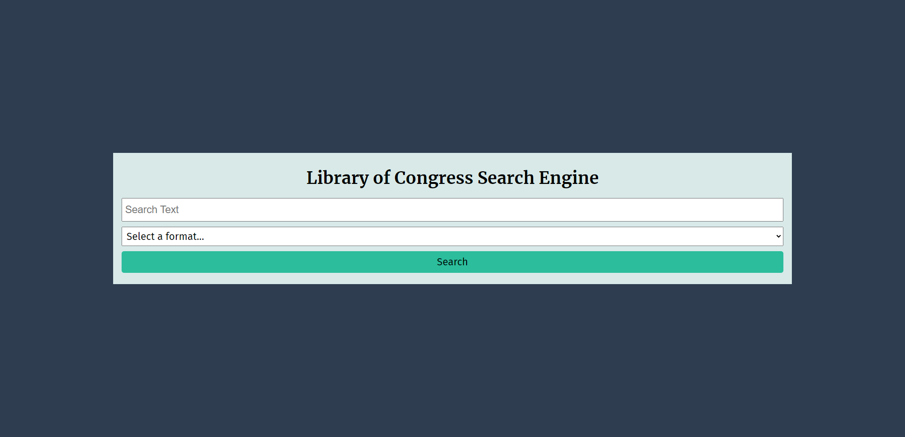
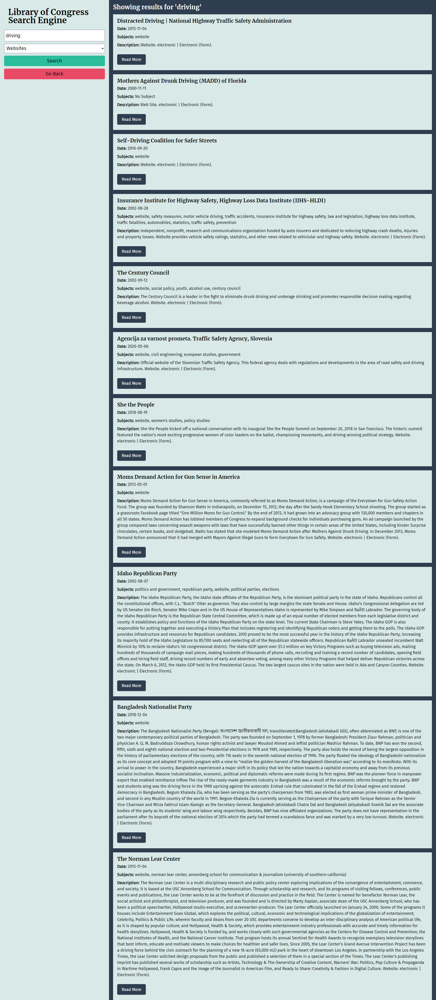

# Congress Search Tool
Application that searches and displays results from the Library of Congress API.

## Description
- Submit a search query to request data from Library of Congress.
- Search results are displayed on a separate page.
- Ability to conduct additional searches from the results page as well.

## Technologies Used

## Deployment
The webpage is deployed to GitHub pages. Use below link to visit the webpage: https://nileshpatel83.github.io/Congress-Search-Tool/

## Screenshots

## License
Please refer to the LICENSE in the repo.
